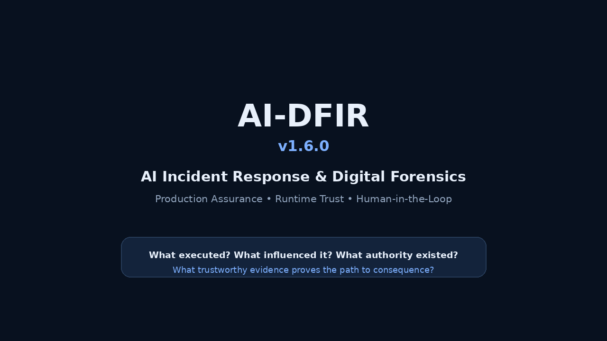

# AI-DFIR v1.7.0 - Investigation Integrity & Offline Verification

**AI-DFIR** is a defensive AI incident-response and digital-forensics platform for investigating models, agents, runtimes, identity, memory, skills, MCP/A2A, representation attacks, provider telemetry, evidence custody, and production assurance.

> **Release status:** v1.7.0 extends the v1.5 signed case-export architecture with investigation-ledger integrity, signed checkpoints, explicit signer-trust semantics, and offline verification. Stable promotion follows successful v1.7.0-rc2 validation of **111/111 Evidence Packs**, all **56 v1.7 regression tests**, committed-source packaging, known-answer verification, and independent verification of the final published GitHub release surface. A GitHub release passing these controls does not by itself certify a specific enterprise deployment as production-ready.

## Why AI-DFIR

AI incidents cross boundaries that conventional DFIR tools often treat separately. AI-DFIR is designed to answer:

1. **What actually executed?** Model, agent, harness, tool implementation, workload, and provider.
2. **What state influenced it?** Prompt, retrieval, memory, cache, skill, workspace instructions, and model/runtime state.
3. **Who had authority at the incident time?** Human, workload, credential, delegation, approval, and tenant context.
4. **What did the machine perceive versus the human?** Includes EvilFont-style glyph remapping, hidden document layers, Unicode, markup, and rendered-output attacks.
5. **What action occurred and what consequence escaped the AI boundary?**
6. **What trustworthy evidence proves each link?**
7. **What evidence is missing, unavailable, stale, conflicting, or untrusted?**

## Major forensic layers

```text
Model integrity / tensor geometry
Activation & behavioral attestation
Runtime provenance & fleet attestation
Evidence preservation / containment / recovery
Universal Evidence Layer & provider adapters
Agentic IR / MCP / A2A / browser & computer use
Representation integrity / EvilFont / Unicode / hidden markup
Workload identity / credential lineage / temporal authority
Memory integrity / skill supply chain / caches / routing
OpenTelemetry GenAI / typed causal graph
Distributed enterprise collection / WORM / KMS / legal hold
Production platform assurance / provider certification / DR / SLOs
Human-in-the-loop review / evidence quality / closure gates
```

## Quick start

Python **3.11+** is required.

```bash
./install.sh default
source .venv/bin/activate

python tests/generate_test_corpus.py
python tests/test_evidence_pack_matrix.py
python tests/run_synthetic_scenarios.py
python scripts/release_check.py --quick
```

Windows PowerShell:

```powershell
.\install.ps1 -Profile default
```

Install profiles:

| Profile | Purpose |
|---|---|
| `default` | Core evidence, agent, runtime, representation, and analyst workflows |
| `model` | Adds PyTorch/Transformers model-integrity dependencies |
| `enterprise` | Adds PostgreSQL and supported cloud/KMS/provider SDKs |
| `dev` | Adds test/lint/release tooling |
| `pdf-agpl` | Optional PyMuPDF profile; **read `LICENSE_GUIDE.md` first** |

See [INSTALL.md](INSTALL.md) for installation details.

## Demo



A reproducible demo uses only synthetic evidence and never requires production credentials:

```bash
python tests/generate_test_corpus.py
python tests/run_synthetic_scenarios.py
python v16_selftest.py --out /tmp/ai-dfir-v16-demo
```

Then launch the read-only Workbench against a prepared case:

```bash
python analyst_dashboard.py --case-root ./cases --host 127.0.0.1 --port 8877
```

Demo assets are under [`docs/demo/`](docs/demo/). Direct video: [`AI-DFIR-v1.6.0-demo.mp4`](docs/demo/AI-DFIR-v1.6.0-demo.mp4).

## Testing

AI-DFIR ships deterministic synthetic validation for the complete current evidence catalog:

```bash
python tests/generate_test_corpus.py
python tests/test_evidence_pack_matrix.py
```

Expected current release result:

```text
111 / 111 Evidence Packs PASS
```

Higher-fidelity synthetic detector scenarios:

```bash
python tests/run_synthetic_scenarios.py
```

Expected current release result:

```text
19 / 19 detector domains PASS
```

Run the release gates:

```bash
python scripts/release_check.py --quick
python scripts/release_check.py --full
```

See [TESTING.md](TESTING.md) and [docs/reference/TEST_SCENARIO_CATALOG.md](docs/reference/TEST_SCENARIO_CATALOG.md).

## Analyst workflow and human oversight

Start with:

- [Analyst Quick Start](docs/analyst/ANALYST_QUICKSTART.md)
- [Incident Workflow](docs/analyst/INCIDENT_WORKFLOW.md)
- [Evidence Quality](docs/analyst/EVIDENCE_QUALITY.md)
- [Human in the Loop](docs/analyst/HUMAN_IN_THE_LOOP.md)
- [Production Human in the Loop](docs/analyst/HUMAN_IN_THE_LOOP_PRODUCTION.md)
- [Causality and Attribution](docs/analyst/CAUSALITY_AND_ATTRIBUTION.md)
- [Closure Criteria](docs/analyst/CLOSURE_CRITERIA.md)

The Workbench is intentionally evidence-oriented and read-only for source evidence. It should support analyst judgment, not replace attribution, containment authority, legal-hold release, or case-closure decisions.

## Deployment

Start with [docs/deployment/README.md](docs/deployment/README.md) and [PRODUCTION_READINESS_V1.6.md](PRODUCTION_READINESS_V1.6.md).

Production deployments should use, at minimum:

- HA PostgreSQL with tested tenant isolation/RLS;
- immutable/WORM evidence storage;
- KMS/HSM-backed envelope encryption;
- OIDC/MFA human identity and cryptographic workload identity such as SPIFFE/mTLS;
- separate lab, staging, and production trust domains;
- validated provider collectors and explicit collection-health evidence;
- tested backup/restore, failover, legal hold, upgrade, and rollback;
- signed release provenance, SBOM, checksums, and admission controls;
- independent security assessment and documented human-review gates.

A GitHub release passing CI is **not** equivalent to a deployment being production-ready.

## Documentation map

Use [docs/README.md](docs/README.md) as the documentation index. Key release documents include:

- [V1.6_RUNBOOK.md](V1.6_RUNBOOK.md)
- [PRODUCTION_READINESS_V1.6.md](PRODUCTION_READINESS_V1.6.md)
- [PLATFORM_ASSURANCE_V1.6.md](PLATFORM_ASSURANCE_V1.6.md)
- [PRODUCTION_ASSURANCE_IMPLEMENTATION_MATRIX_V1.6.md](PRODUCTION_ASSURANCE_IMPLEMENTATION_MATRIX_V1.6.md)
- [THREAT_MODEL.md](THREAT_MODEL.md)
- [DATA_HANDLING.md](DATA_HANDLING.md)
- [SECURITY.md](SECURITY.md)

## GitHub publication

The repository includes issue/PR templates, Dependabot, CI, CodeQL, dependency review, OpenSSF Scorecard, release/provenance, container-signing, and documentation checks under `.github/`.

Before publishing, follow [UPLOAD_CHECKLIST.md](UPLOAD_CHECKLIST.md). A `CODEOWNERS` file is intentionally **not activated with a fake owner**; use `.github/CODEOWNERS.example` once the actual GitHub user/team is known.

## Licensing

AI-DFIR is licensed under **Apache License 2.0**. Review:

- [LICENSE](LICENSE)
- [NOTICE](NOTICE)
- [LICENSE_GUIDE.md](LICENSE_GUIDE.md)
- [THIRD_PARTY_NOTICES.md](THIRD_PARTY_NOTICES.md)

**PyMuPDF is not installed by default** because its AGPL/commercial licensing differs from the AI-DFIR project license. The optional PDF profile is deliberately separated.

## Security reporting

Do **not** open a public issue containing exploit details, credentials, private keys, customer evidence, or sensitive provider data. Follow [SECURITY.md](SECURITY.md) and use GitHub Private Vulnerability Reporting when enabled.

## Project status

AI-DFIR is a defensive/reference implementation with production-assurance controls. Its test results establish the behavior of the released software and synthetic fixtures; they do not certify an organization's IdP, cloud permissions, provider retention, database cluster, KMS/HSM, or evidence-storage deployment.
